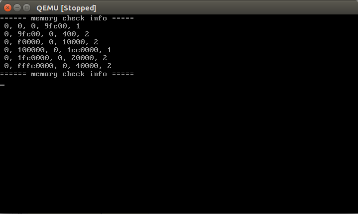
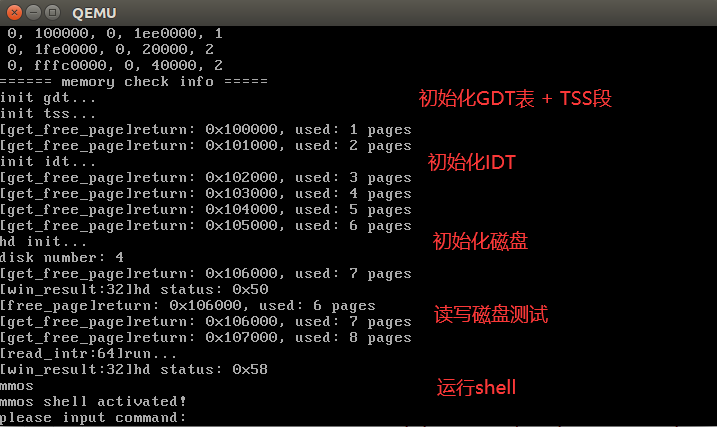

# MMOS
MMOS是一个简单的32Bit操作系统内核，是为了将书中理论与实际相结合，满足我的好奇心而建立的。有很多东西都是秉承着“能跑就行”的思想完成的，所以架构混乱、安全性堪忧。同时某些模块借鉴了成熟的方法，如虚拟内存分配使用伙伴算法，文件系统使用了FAT32.  
后面读了部分Linux2.6 源码，这也是CFS完全公平调度算法刚引入的版本，第一次见Linux的调度思想确实让人眼前一亮，豁然开朗🎉。  
整体它包含以下内容：
- Bootloader
  - 加载操作系统内核到固定位置再读取
  - 突破引导程序512Bytes限制，可使用另外的文件扩展更多启动功能
- 设备管理
  - 显卡`VGA Text Mode`，实现纯文本模式下的换行、退格、文本显示功能。
  - 键盘驱动 能够识别键按下、键抬起、Shift映射码、LED灯状态。
  - 磁盘驱动 能够读写`指定扇区号`写入`指定大小`内容，并对外提供接口。
- 内存管理
  - 除去系统占用部分，管理可用的物理内存
  - 使用`伙伴算法`思想实现kmalloc对虚拟内存进行管理
- 进程管理
  - 支持任务调度，使用`时间片+优先级`调度
  - 支持任务的`阻塞、睡眠、唤醒`操作
- 文件管理
  - 支持FAT32文件系统，提供文件目录的创建、删除接口，提供查看文件等接口。
- 常用库
  - 实现`printf`，支持`可变参数`输出
  - 实现`exit` 退出当前进程
  - 实现`strcpy、strcmp、memcpy`等函数
# 运行
## 环境准备
- bochs / QEMU虚拟机
- gcc编译环境
## 编译运行
```shell
cd mmos
make all
make bochs 或者 make qemu
```
## 调试
和Linux内核一样，支持GDB远程调试
已在Makefile中配置
## 运行效果

